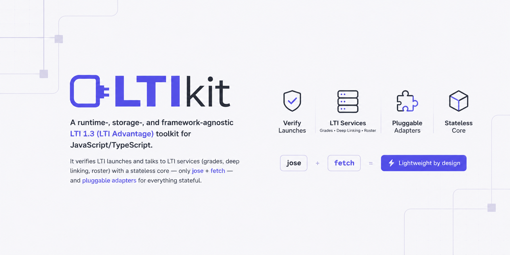

<p align="center">
  
</p>

# LTIkit

Runtime-, storage-, and framework-agnostic **LTI 1.3 (LTI Advantage)** toolkit for JavaScript/TypeScript.

Runs on serverless and edge (Next.js, Hono, Cloudflare Workers, Lambda) — no Express, no MongoDB. Bring your own database via small adapters. Verified live against **Canvas** and **MoodleCloud**: SSO, deep linking, grade passback (AGS), and roster (NRPS).

> **Status (1.0-rc):** the full launch loop + LTI Advantage services (deep linking, AGS, NRPS), **Dynamic Registration**, and **cookieless launches (Platform Storage)** — live-verified against Canvas + MoodleCloud, with an auth-agnostic session seam. See the [**Roadmap**](https://alasim.github.io/ltikit/roadmap/) and [Capabilities](https://alasim.github.io/ltikit/reference/capabilities/) for the path to a complete LTI 1.3 toolkit (internal build process: [`ROADMAP.md`](./ROADMAP.md), design: [`DESIGN.md`](./DESIGN.md)).

## Why

`ltijs` assumes Express + MongoDB + in-process state. LTIkit is the opposite: a **stateless core** (only `jose` + `fetch`) with all state behind small adapter interfaces, plus thin per-framework bindings. It runs anywhere JS runs, including the edge.

A small **required core** + **swappable slots** (storage, framework binding, auth) — you keep your stack and plug it in.

## Which packages do I need?

Always start with `@ltikit/core`, then add **one** framework binding and **one** (or mixed)
storage adapter:

| Your stack | Install |
|---|---|
| Next.js + any DB via Prisma (SQLite, Postgres, MySQL — zero external service) | `npm i @ltikit/core @ltikit/next @ltikit/adapter-prisma` |
| Next.js + Supabase / Postgres | `npm i @ltikit/core @ltikit/next @ltikit/adapter-supabase` |
| Next.js + Redis (nonces) + Prisma or Supabase (platforms) | `npm i @ltikit/core @ltikit/next @ltikit/adapter-redis @ltikit/adapter-prisma` |
| Hono / edge (Workers, Deno, Bun) + Redis + Supabase | `npm i @ltikit/core @ltikit/hono @ltikit/adapter-redis @ltikit/adapter-supabase` |
| Hand-rolled framework, your own storage | `npm i @ltikit/core` |
| Local dev / tests only | `npm i -D @ltikit/core @ltikit/adapter-memory` |

See [How it fits together](https://alasim.github.io/ltikit/getting-started/how-it-fits/) for the full map.

## Packages

| Package | What |
|---|---|
| [`@ltikit/core`](https://www.npmjs.com/package/@ltikit/core) | LTI 1.3 logic: JWT verify/sign, OIDC login, launch, AGS, NRPS, deep linking, dynamic registration, identity. jose only. |
| [`@ltikit/next`](https://www.npmjs.com/package/@ltikit/next) | Next.js App Router bindings (Web `Request`/`Response`) + iframe helpers + cookieless Platform Storage (`/client`). |
| [`@ltikit/hono`](https://www.npmjs.com/package/@ltikit/hono) | Hono route bindings. |
| [`@ltikit/adapter-supabase`](https://www.npmjs.com/package/@ltikit/adapter-supabase) | `PlatformStore` + `NonceStore` on Supabase/Postgres. |
| [`@ltikit/adapter-redis`](https://www.npmjs.com/package/@ltikit/adapter-redis) | `NonceStore` on Redis / Upstash (serverless-friendly). |
| [`@ltikit/adapter-prisma`](https://www.npmjs.com/package/@ltikit/adapter-prisma) | `PlatformStore` + `NonceStore` on Prisma — any Prisma-supported DB (SQLite, Postgres, MySQL). |
| [`@ltikit/adapter-memory`](https://www.npmjs.com/package/@ltikit/adapter-memory) | In-memory stores for dev/tests. |

## Quick look

```ts
import { createLti, staticKeyStore, ltiIdentity } from '@ltikit/core'
import { prismaPlatformStore, prismaNonceStore } from '@ltikit/adapter-prisma'
import { launch, sessionRedirect } from '@ltikit/next'

// swap in Redis / Supabase / memory — same interface
export const lti = createLti({ keys, platforms: prismaPlatformStore(db), nonces: prismaNonceStore(db) })

// app/api/lti/launch/route.ts
export const POST = launch(lti, async (result) => {
  const id = ltiIdentity(result.claims)   // sub, email?, roles, isInstructor…
  // create your user + session with your auth lib, then:
  return sessionRedirect({ to: '/home', cookies: [/* your session cookie */] })
})
```

**Docs:** guides, API reference, and the "how it fits together" map live in [`docs/`](./docs) (Astro Starlight).

## Examples

Two complete, runnable reference tools — each does the full loop (SSO → deep linking → grade passback → roster) against a real LMS:

| Example | Stack | Highlights |
|---|---|---|
| [`examples/next-prisma-demo`](./examples/next-prisma-demo) | Next.js + Prisma/SQLite + NextAuth | **Zero external service** — clone & launch. Full parity + Dynamic Registration, cookieless Platform Storage, seeded login page. |
| [`examples/next-demo`](./examples/next-demo) | Next.js + Supabase | Minimal loop; ships a bundled local Supabase (Docker) or point it at your own. |

New to LTIkit? Start with **next-prisma-demo** — SQLite means no Docker or Supabase account. See the [Examples guide](https://alasim.github.io/ltikit/examples/) for ~2-minute run steps.

## Develop

```bash
pnpm install
pnpm build      # build all packages (tsup)
pnpm test       # vitest
pnpm lint       # eslint (core stays dependency-clean)
pnpm typecheck
```

Monorepo: pnpm workspaces + Changesets. `@ltikit/core` is lint-enforced to depend only on `jose`.

## Support

LTIkit is free, open source, and maintained solo. If you'd rather not wire up Canvas/Moodle
registration, grade passback, deep linking, or Platform Storage yourself, I offer paid setup help:

- **Book a call:** [cal.com/alasim/30min](https://cal.com/alasim/30min)
- **Email:** [alasim.mail@gmail.com](mailto:alasim.mail@gmail.com)

A paid setup call is currently the best way to support ongoing maintenance — a tip jar (GitHub
Sponsors) is planned but not live yet. See [Need help?](https://alasim.github.io/ltikit/support/)
in the docs.
