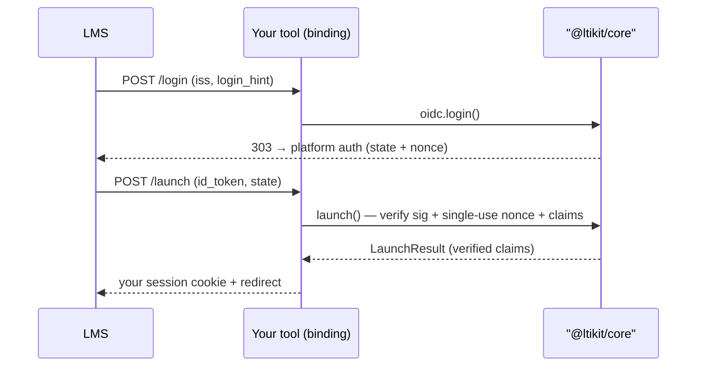

## The pieces

- **core** = logic (pure functions over `jose` + `fetch`).
- **adapters** = state you provide: `NonceStore` (OIDC handshake), `PlatformStore` (trusted LMSs),
  `KeyStore` (your signing keypair).
- **bindings** = thin `Request` → core → `Response` glue (`@ltikit/next`).

## The flows

```
OIDC init:   LMS ──POST──▶ oidcLogin()  ──303──▶ platform auth endpoint
Launch:      LMS ──POST id_token,state──▶ launch()  → verified LaunchResult
Deep link:   launch() (DeepLinking) → your picker → deepLinking.signResponse() → auto-submit → LMS
AGS score:   ags.publishScore() → getToken (client_credentials) → POST {lineItem}/scores
JWKS:        LMS ──GET──▶ jwks()  (verifies our signed assertions / deep-link responses)
```

The OIDC + launch handshake:



## The two JWT directions (the central idea)

| | Signer | Verifier | `aud` |
|---|---|---|---|
| Inbound launch (`id_token`) | LMS | LTIkit (via `platform.keysetUrl`) | tool `clientId` |
| Outbound assertion (AGS token, deep-link response) | LTIkit (`KeyStore`) | LMS (via our `jwks()`) | `platform.tokenEndpoint` (assertion) / issuer (DL) |

## Security model

- **Nonce**: single-use via `NonceStore.consume` (atomic fetch+delete) → replay protection, TTL-bounded.
- **State ↔ platform binding**: the launch must match the platform the login was started for.
- **Clock skew**: `jose` clock tolerance on `exp` / `iat` (default 30s).
- **Identify by `sub`**, not email (some users have none).
- **Never log** key material or signed tokens.

## Launch result

`launch()` returns a typed `LaunchResult` with `platform`, `claims`, `messageType`, and parsed
`context` / `resourceLink` / `ags` / `nrps` / `deepLinking`. From `claims`, `ltiIdentity()` gives you a
normalized user object to bridge into your own session.
