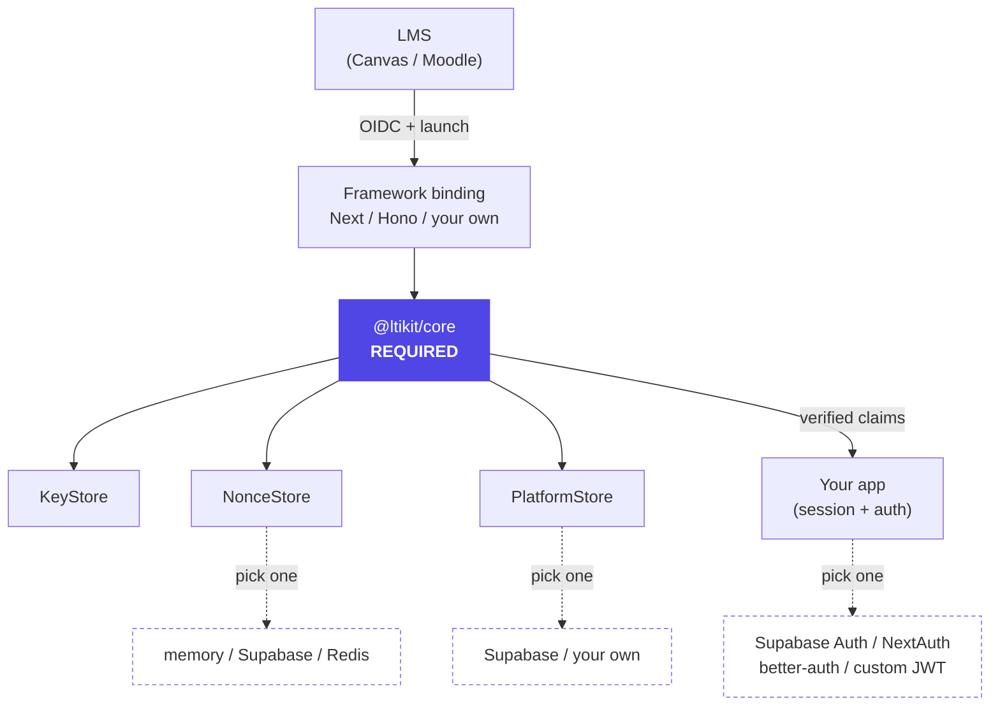

import { LinkCard, CardGrid, Aside } from '@astrojs/starlight/components'

LTIkit is a small **required core** plus a few **swappable slots**. You don't adopt a stack — you keep yours
and plug it in. This page is the map.

## Anatomy

Solid boxes are things you always have; dashed boxes are choices.

## What's required vs. what you choose

| Piece | Required? | Your options |
|---|---|---|
| `@ltikit/core` | **Always** | — (the toolkit) |
| `KeyStore` (your RS256 keypair) | **Always** | `staticKeyStore` (env PEM) · your KMS |
| `NonceStore` (OIDC handshake state) | **Always** | memory · **Supabase** · **Redis** · your own |
| `PlatformStore` (trusted LMSs) | **Always** | **Supabase** · your own |
| HTTP glue (route handlers) | **Always** | `@ltikit/next` · `@ltikit/hono` · hand-rolled `Request`→`Response` |
| Session / auth | **Your app** | Supabase Auth · NextAuth · better-auth · custom JWT |

<Aside type="tip">
The whole job: provide those three adapter interfaces (or drop in a prebuilt adapter) and one route binding.
Everything else — deep linking, grades, roster — is stack-agnostic and works the same regardless of your choices.
</Aside>

## Which packages do I need?

Always start with `@ltikit/core`, then add **one** framework binding and **one** (or mixed)
storage adapter. Pick the row that matches your stack:

| Your stack | Install |
|---|---|
| Next.js + Supabase (most common) | `npm i @ltikit/core @ltikit/next @ltikit/adapter-supabase` |
| Next.js + Redis (nonces) + Supabase (platforms) | `npm i @ltikit/core @ltikit/next @ltikit/adapter-redis @ltikit/adapter-supabase` |
| Next.js + Prisma/SQLite + NextAuth | `npm i @ltikit/core @ltikit/next @ltikit/adapter-prisma` |
| Hono / edge (Workers, Deno, Bun) + Redis + Supabase | `npm i @ltikit/core @ltikit/hono @ltikit/adapter-redis @ltikit/adapter-supabase` |
| Hand-rolled framework, your own storage | `npm i @ltikit/core` |
| Local dev / tests only | `npm i -D @ltikit/core @ltikit/adapter-memory` |

<Aside type="caution" title="Memory adapter">
`@ltikit/adapter-memory` is dev/tests only — state is per-process and lost on restart, so it can't
enforce single-use nonces across serverless invocations. Never ship it to production.
</Aside>

## Choose your pieces

<CardGrid>
  <LinkCard title="Storage adapters" href="../guides/storage/" description="Where nonces + platforms live: Supabase, Redis, memory, or your own." />
  <LinkCard title="Framework bindings" href="../guides/frameworks/" description="Wire routes with Next.js, Hono, or plain Web Request/Response." />
  <LinkCard title="Auth integration" href="../guides/auth-integration/" description="Turn a verified launch into a session with your existing auth library." />
</CardGrid>

## LTI features (any stack)

These work the same no matter what you picked above:

<CardGrid>
  <LinkCard title="Deep linking" href="../guides/deep-linking/" description="Let instructors select content the LMS places." />
  <LinkCard title="Grade passback (AGS)" href="../guides/grade-passback/" description="Post scores to the gradebook." />
  <LinkCard title="Roster (NRPS)" href="../guides/roster/" description="Fetch course members." />
  <LinkCard title="Running in an iframe" href="../guides/iframe/" description="CSP + cookies for LMS embedding." />
</CardGrid>
