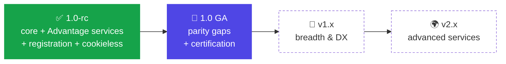

import { Aside, LinkCard } from '@astrojs/starlight/components'

LTIkit's goal is a **complete, correct LTI 1.3 (LTI Advantage)** toolkit that supports every major
LMS integration feature — while staying runtime-, storage-, and framework-agnostic (just `jose` +
`fetch`, bring your own database).

This page is the honest picture: what's shipped, what's partial, and where it's headed. For the
per-feature status grid, see [Capabilities](../reference/capabilities/).

**Legend:** ✅ shipped · ◑ partial · 🔜 next · 🔲 future · 🚫 out of scope

## ✅ Shipped (1.0-rc)

The full launch loop plus the LTI Advantage services, verified live against **Canvas** and
**MoodleCloud**.

- **SSO / launch** — OIDC third-party login + launch verification (RS256 signature, single-use
  nonce replay defense, `iss`/`aud`/`exp`/`nonce`/`azp`/`deployment_id` validation).
- **JWKS** — serve the tool's public keyset for the platform to verify signed messages.
- **Deep Linking** ◑ — sign the content-selection response + auto-submit form; `lineItem` on items
  (graded content). Currently `ltiResourceLink` items only.
- **Assignment & Grade Services (AGS)** ◑ — line items (list / create / get), score publish
  (`gradingProgress: FullyGraded`, cross-LMS gotchas baked in), results. No line-item update/delete yet.
- **Names & Role Provisioning (NRPS)** ◑ — course roster with `Link rel=next` pagination, `role` /
  `limit` filters. Context-level membership.
- **Dynamic Registration** ✅ — automatic tool onboarding (OpenID Connect Dynamic Client
  Registration); the LMS auto-configures and the platform is persisted with no manual setup.
- **LTI Platform Storage (cookieless)** ✅ — client-side `postMessage` state so a tool stays logged
  in inside the LMS iframe when third-party cookies are blocked (Safari ITP, Firefox TCP).
- **Identity seam** — `ltiIdentity()` + role helpers; you own session creation (auth-agnostic).
- **Adapters** — `@ltikit/adapter-memory`, `@ltikit/adapter-redis` (nonce), `@ltikit/adapter-supabase`
  (platform + nonce). **Bindings** — `@ltikit/next`, `@ltikit/hono`.

## 🎯 v1.0 GA — parity + certification

Close the gaps real cross-LMS use and certification need, then certify.

- **Fuller launch surface** — typed `custom`, `launch_presentation`, and `tool_platform` on
  `LaunchResult` (today reachable only via the raw claims bag).
- **AGS** — line item **update** + **delete**; the score `submission` object.
- **Deep Linking** — `link`, `html`, `file`, and `image` content types; `iframe` / `window`
  presentation.
- **NRPS** — resource-link-level membership (`rlid`) and `differences`.
- **1EdTech LTI Advantage certification** — the credibility milestone; tags **1.0 GA** on pass.

## 🔭 v1.x — breadth & developer experience

- **Submission Review** (`LtiSubmissionReviewRequest`) — let faculty review a learner's submission
  from the LMS gradebook (e.g. Canvas SpeedGrader).
- **`TokenCache` adapter** — optional shared cache for AGS/NRPS access tokens; speeds up bulk grade
  sync / roster pulls (off by default).
- **More `postMessage` helpers** — `lti.get_page_content`, `lti.scrollToTop`, `lti.showAlert`,
  alongside the shipped `frameResize` + Platform Storage.
- **More bindings** — Express, SvelteKit, Remix (edge / Cloudflare Workers / Deno / Bun already work
  through the web-standard core).
- **More adapters** — Prisma, Drizzle, DynamoDB, Mongo; a Redis `PlatformStore`.

## 🌍 v2.x — advanced Advantage services

- **Course Groups service** — group sets and group memberships.
- **Proctoring & Assessment** — Assessment Control Service (ACS).
- **Assets service / Asset Processor** — submission asset handling.
- **Caliper Analytics / xAPI** — learning-event emission.

<Aside type="note" title="Out of scope">
**LTI 1.1 / Basic Outcomes** — LTIkit is 1.3 / Advantage only. There are no plans to support the
legacy 1.1 launch or Basic Outcomes; migrate links to 1.3.
</Aside>

---

<LinkCard
  title="Capabilities matrix"
  href="../reference/capabilities/"
  description="The full per-feature status grid — what's in, what's partial, what's planned."
/>

*Status reflects the current release line. Something you need sitting in a later milestone? Open an
issue — real demand reorders the roadmap.*
